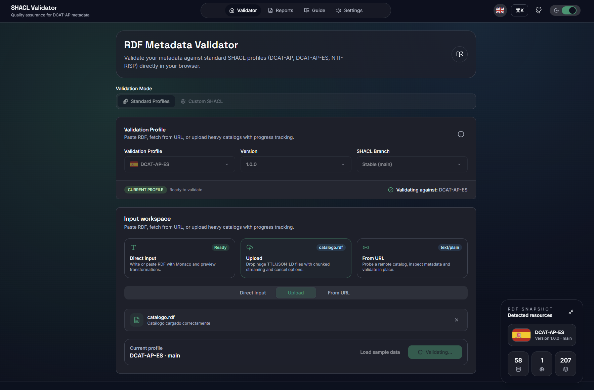
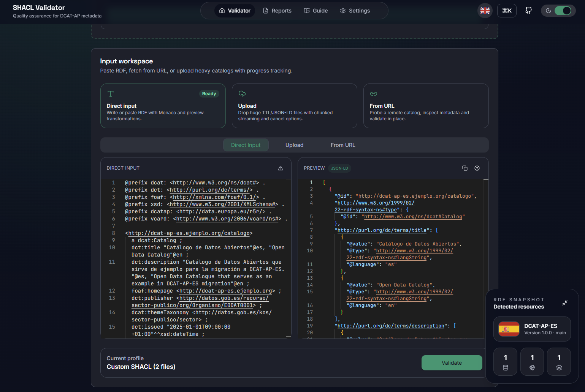
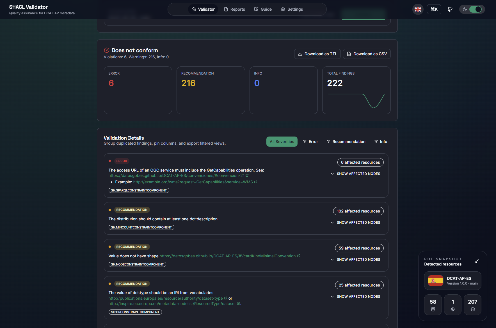
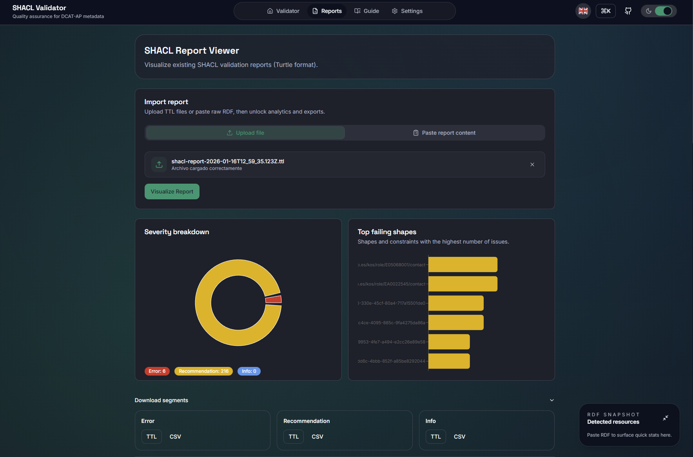
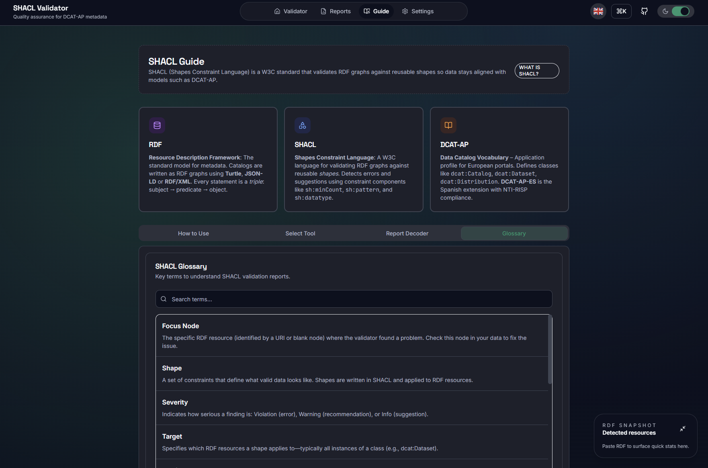

# Validador SHACL

<p align="center">
	<a href="https://mjanez.github.io/shacl-validator/">
		
	</a>
	<a href="README.md">
		
	</a>
	<a href="README.es.md">
		
	</a>
</p>

<p align="center">
  <strong>Evaluación de calidad para metadatos DCAT-AP-ES</strong><br>
  Aplicación web para validar catálogos RDF contra formas SHACL y analizar informes de validación.
</p>

---

## Características

### Modos de validación

- **Perfiles de aplicación**: formas SHACL preconfigurados para [DCAT-AP-ES](https://datosgobes.github.io/DCAT-AP-ES/), [NTI-RISP (2013)](https://datosgobes.github.io/NTI-RISP/) y [DCAT-AP](https://semiceu.github.io/DCAT-AP/), 
- **SHACL personalizado**: sube tus propios shapes SHACL para reglas de validación personalizadas
- **Visor de informes**: importa y analiza informes de validación SHACL existentes (formato Turtle)

### Análisis y visualización

- **Panel de control**: gráficos interactivos con desglose por severidad y shapes más problemáticos
- **RDF Snapshot**: estadísticas en tiempo real de recursos detectados (catálogos, datasets, distribuciones)
- **Métricas avanzadas**: desglose por propiedades, distribución de nodos focales y análisis de restricciones

### Métodos de entrada

- **Entrada directa**: editor Monaco con resaltado de sintaxis para formatos RDF
- **Carga de archivos**: arrastra y suelta o busca archivos TTL/JSON-LD con streaming por fragmentos
- **Carga desde URL**: obtén y valida catálogos remotos

### Opciones de exportación

- **Informes TTL enriquecidos**: exportaciones Turtle mejoradas con metadatos (creador, información del perfil, descripciones)
- **Descargas CSV**: exportaciones compatibles con hojas de cálculo para filtrar por severidad
- **Exportación por Segmentos**: descarga errores (violaciones), recomendaciones (advertencias) e informaciones por separado

---

## Capturas de pantalla

### Guía SHACL
Contenido educativo explicando los conceptos de RDF, SHACL y catálogos de datos.


### Perfiles preconfigurados
Formas SHACL preconfiguradas para Perfiles de Aplicación {DCAT-AP-ES, NTI-RISP (2013), DCAT-AP}.


### Validación SHACL personalizada
Sube tus propias formas SHACL para reglas de validación personalizadas.


### Espacio de trabajo del validador
Editor Monaco con resaltado de sintaxis y vista previa RDF en JSON-LD.



### Resultados de validación
Informe de validación completo con hallazgos detallados y snapshot RDF.



### Visor de informes con análisis
Importa informes SHACL existentes y analízalos con gráficos interactivos.



### Glosario SHACL
Terminología con búsqueda para comprender informes de validación.



---

## Inicio rápido

### Requisitos

- Node.js 18+ y npm

### Instalación

```bash
# Clonar el repositorio
git clone https://github.com/mjanez/shacl-validator.git
cd shacl-validator

# Instalar dependencias
npm install
```

### Desarrollo

```bash
# Iniciar servidor de desarrollo
npm run dev
```

Aplicación disponible en `http://localhost:3000`

### Compilación

```bash
# Compilar para producción
npm run build
```

Archivos estáticos generados en el directorio `dist/`.

### Desplegar en GitHub Pages

```bash
# Desplegar en rama gh-pages
npm run deploy
```

---

## Stack tecnológico

| Categoría | Tecnologías |
|-----------|-------------|
| **Framework** | React 19 + TypeScript |
| **Herramienta de Build** | Vite 7.3 con SWC |
| **Motor SHACL** | shacl-engine 1.1 (carga diferida) |
| **Parseo RDF** | N3.js, rdfxml-streaming-parser, jsonld |
| **Editor** | Monaco Editor |
| **Componentes UI** | Primitivos Radix UI |
| **Estilos** | Tailwind CSS 3 |
| **Gráficos** | Recharts con D3 |
| **i18n** | i18next + react-i18next |

---

## Estructura

```
shacl-validator/
├── src/
│   ├── components/
│   │   ├── Validator/          # Interfaz de validación RDF
│   │   │   ├── ValidatorInput.tsx
│   │   │   └── ValidationResults.tsx
│   │   ├── Viewer/             # Interfaz de análisis de informes
│   │   │   └── ReportViewer.tsx
│   │   ├── Guide/              # Contenido educativo
│   │   │   └── EducationalContent.tsx
│   │   ├── Settings/           # Panel de configuración
│   │   │   └── SettingsPanel.tsx
│   │   ├── layout/             # Componentes de estructura
│   │   │   ├── Layout.tsx
│   │   │   ├── Sidebar.tsx
│   │   │   ├── FloatingRdfStats.tsx
│   │   │   └── CommandPalette.tsx
│   │   └── ui/                 # Componentes UI reutilizables
│   ├── services/
│   │   ├── SHACLValidationService.ts   # Lógica de validación SHACL
│   │   ├── RDFService.ts               # Parseo y conversión RDF
│   │   └── DataDiscoveryService.ts     # Detección de recursos
│   ├── config/
│   │   └── mqa-config.json             # Definiciones de perfiles
│   ├── workers/
│   │   └── reportWorker.ts             # Web Worker para procesamiento pesado
│   └── types/
│       ├── types.ts
│       └── dataQuality.ts
└── public/
    └── locales/                # Traducciones i18n
        ├── en/
        └── es/
```

---

## Configuración

### Configuración de perfiles de validación

Edita `src/config/mqa-config.json` para añadir o modificar perfiles de validación:

```json
{
  "profiles": {
    "dcat_ap_es": {
      "name": "DCAT-AP-ES",
      "defaultVersion": "1.0.0",
      "defaultBranch": "main",
      "versions": {
        "1.0.0": {
          "name": "DCAT-AP-ES 1.0.0",
          "url": "https://datosgobes.github.io/DCAT-AP-ES/",
          "shaclFiles": [
            "https://raw.githubusercontent.com/datosgobes/DCAT-AP-ES/{branch}/shacl/1.0.0/dcat_ap_es.ttl"
          ]
        }
      }
    }
  }
}
```

### Variables de entorno

Vite utiliza `import.meta.env`:

- `BASE_URL`: Ruta base para despliegue (por defecto: `/`)
- `MODE`: Modo de desarrollo o producción

---

## Contribuir

¡Las contribuciones son bienvenidas! Por favor, sigue estos pasos:

1. Haz un fork del repositorio
2. Crea una rama de característica (`git checkout -b feature/custom-feature`)
3. Commitea tus cambios (`git commit -m 'feat: añade custom feature'`)
4. Haz push a la rama (`git push origin feature/custom-feature`)
5. Abre un Pull Request

---

## Licencia

[CC-BY-4.0](LICENSE) - Copyright (c) 2025 [mjanez](https://github.com/mjanez)

---

## Agradecimientos

- [SHACL W3C Recommendation](https://www.w3.org/TR/shacl/)
- [Perfil de Aplicación DCAT para portales de datos en Europa (DCAT-AP)](https://semiceu.github.io/DCAT-AP/)
- [Perfil de Aplicación DCAT-AP de España (DCAT-AP-ES)](https://datosgobes.github.io/DCAT-AP-ES/)
- [shacl-engine](https://github.com/zazuko/shacl-engine) para validación SHACL
- [Monaco Editor](https://microsoft.github.io/monaco-editor/) para edición de código
