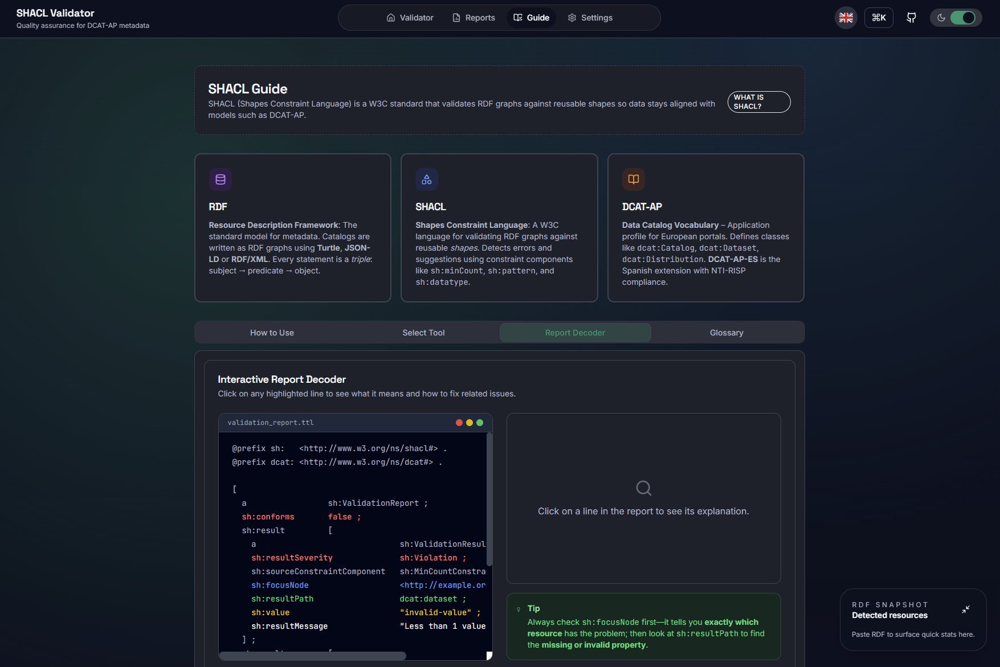

# SHACL Validator

<p align="center">
	<a href="https://mjanez.github.io/shacl-validator/">
		
	</a>
	<a href="README.md">
		
	</a>
	<a href="README.es.md">
		
	</a>
</p>

<p align="center">
  <strong>Quality assurance for DCAT-AP-ES metadata</strong><br>
  Web application for validating RDF catalogs against SHACL shapes and analyzing validation reports.
</p>

---

## Features

### Validation Modes

- **Aplication Profiles**: Pre-configured SHACL shapes for [DCAT-AP-ES](https://datosgobes.github.io/DCAT-AP-ES/), [NTI-RISP (2013)](https://datosgobes.github.io/NTI-RISP/) and [DCAT-AP](https://semiceu.github.io/DCAT-AP/)
- **Custom SHACL**: Upload your own SHACL shapes for custom validation rules
- **Report Viewer**: Import and analyze existing SHACL validation reports (Turtle format)

### Analytics & Visualization

- **Dashboard**: Interactive charts with severity breakdown and top failing shapes
- **RDF Snapshot**: Real-time statistics of detected resources (datasets, data services, distributions)
- **Advanced Metrics**: Property breakdown, focus node distribution, and constraint analysis

### Input Methods

- **Direct Input**: Monaco editor with syntax highlighting for RDF formats
- **File Upload**: Drag & drop or browse for TTL/JSON-LD files with chunked streaming
- **URL Loading**: Fetch and validate remote catalogs

### Export Options

- **Rich TTL Reports**: Enhanced Turtle exports with metadata (creator, profile info, descriptions)
- **CSV Downloads**: Spreadsheet-compatible exports for filtering by severity
- **Segment Export**: Download violations, recommendations, and infos separately

---

## Screenshots

### SHACL Guide
Educational content explaining RDF, SHACL, and data catalog concepts.



### Pre-configured Profiles
Pre-configured import SHACL shapes for Application Profiles {DCAT-AP-ES, NTI-RISP (2013), DCAT-AP}.


### Custom SHACL Validation
Upload your own SHACL shapes for custom validation rules.


### Validator Input Workspace
Monaco editor with syntax highlighting and RDF preview.


### Validation Results
Comprehensive validation report with detailed findings and RDF snapshot (JSON-LD).


### Report Viewer with Analytics
Import existing SHACL reports and analyze with interactive charts.


### SHACL Glossary
Searchable terminology for understanding validation reports.


---

## Quick Start

### Prerequisites

- Node.js 18+ and npm

### Installation

```bash
# Clone the repository
git clone https://github.com/mjanez/shacl-validator.git
cd shacl-validator

# Install dependencies
npm install
```

### Development

```bash
# Start development server
npm run dev
```

Application available at `http://localhost:3000`

### Build

```bash
# Build for production
npm run build
```

Static files generated in `dist/` directory.

### Deploy to GitHub Pages

```bash
# Deploy to gh-pages branch
npm run deploy
```

---

## Technology Stack

| Category | Technologies |
|----------|-------------|
| **Framework** | React 19 + TypeScript |
| **Build Tool** | Vite 7.3 with SWC |
| **SHACL Engine** | shacl-engine 1.1 (lazy loaded) |
| **RDF Parsing** | N3.js, rdfxml-streaming-parser, jsonld |
| **Editor** | Monaco Editor |
| **UI Components** | Radix UI primitives |
| **Styling** | Tailwind CSS 3 |
| **Charts** | Recharts with D3 |
| **i18n** | i18next + react-i18next |

---

## Project Structure

```
shacl-validator/
├── src/
│   ├── components/
│   │   ├── Validator/          # RDF validation interface
│   │   │   ├── ValidatorInput.tsx
│   │   │   └── ValidationResults.tsx
│   │   ├── Viewer/             # Report analysis interface
│   │   │   └── ReportViewer.tsx
│   │   ├── Guide/              # Educational content
│   │   │   └── EducationalContent.tsx
│   │   ├── Settings/           # Configuration panel
│   │   │   └── SettingsPanel.tsx
│   │   ├── layout/             # App shell components
│   │   │   ├── Layout.tsx
│   │   │   ├── Sidebar.tsx
│   │   │   ├── FloatingRdfStats.tsx
│   │   │   └── CommandPalette.tsx
│   │   └── ui/                 # Reusable UI components
│   ├── services/
│   │   ├── SHACLValidationService.ts   # SHACL validation logic
│   │   ├── RDFService.ts               # RDF parsing & conversion
│   │   └── DataDiscoveryService.ts     # Resource detection
│   ├── config/
│   │   └── mqa-config.json             # Profile definitions
│   ├── workers/
│   │   └── reportWorker.ts             # Web Worker for heavy processing
│   └── types/
│       ├── types.ts
│       └── dataQuality.ts
└── public/
    └── locales/                # i18n translations
        ├── en/
        └── es/
```

---

## Configuration

### Profile Configuration

Edit `src/config/mqa-config.json` to add or modify validation profiles:

```json
{
  "profiles": {
    "dcat_ap_es": {
      "name": "DCAT-AP-ES",
      "defaultVersion": "1.0.0",
      "defaultBranch": "main",
      "versions": {
        "1.0.0": {
          "name": "DCAT-AP-ES 1.0.0",
          "url": "https://datosgobes.github.io/DCAT-AP-ES/",
          "shaclFiles": [
            "https://raw.githubusercontent.com/datosgobes/DCAT-AP-ES/{branch}/shacl/1.0.0/dcat_ap_es.ttl"
          ]
        }
      }
    }
  }
}
```

### Environment Variables

Vite uses `import.meta.env`:

- `BASE_URL`: Base path for deployment (default: `/`)
- `MODE`: Development or production mode

---

## Contributing

Contributions are welcome! Please follow these steps:

1. Fork the repository
2. Create a feature branch (`git checkout -b feature/custom-feature`)
3. Commit your changes (`git commit -m 'feat: add custom feature'`)
4. Push to the branch (`git push origin feature/custom-feature`)
5. Open a Pull Request

---

## License

[CC-BY-4.0](LICENSE) - Copyright (c) 2025 [mjanez](https://github.com/mjanez)

---

## Acknowledgments

- [SHACL W3C Recommendation](https://www.w3.org/TR/shacl/)
- [DCAT Application Profile for data portals in Europe (DCAT-AP)](https://semiceu.github.io/DCAT-AP/)
- [Spanish DCAT-AP Application Profile (DCAT-AP-ES)](https://datosgobes.github.io/DCAT-AP-ES/)
- [shacl-engine](https://github.com/zazuko/shacl-engine) for SHACL validation
- [Monaco Editor](https://microsoft.github.io/monaco-editor/) for code editing
